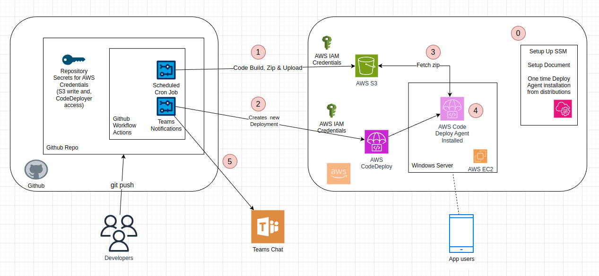

# Dotnet 6 | C# webapp | Github Actions Workflow CI | AWS IIS Deployment | Teams notifications




## Problem statement

We have a Github repo and a dotnet webapp hosted on windows server IIS (AWS EC2). Requirement is to build an automated workflow in 3 parts where.

**Part 1:** Code is pushed to github repo and it triggers Github workflow to build the dotnet app, zip the build files and push to an AWS S3 bucket.

**Part 2:** S3 update triggers a CodeDeploy on the EC2 server, running other service scripts as well.

**Part 3:** Once the deployement is successful. Deployment status is updated  via Teams notifications

### Here are the steps invoved in the process

**Step 0:** Perform one-time CodeDeploy agent installation, Create SSM document for CodeDeploy, Setup S3 write access credentials for Github workflow Agent  

**Step 1:** Triggered build, zip and code push to AWS S3 from Github workflows. Steps in workflow yaml

**Step 2:** S3 Update triggers a CodeDeploy via CodeDeploy agent in the windows server.

**Step 3:** Code deploy agent fethcing the S3 code, unzipping it, running the app and relevant services, and restarting the IIS site.
 

**Step 4:** Code Deploy agent sends the teams group notifications 

**Step 5:** Team chat displays the Deploy status.


## Build and Dev
```sh
dotnet restore
dotnet build
dotnet run
```


## Project setup 
```sh
sudo apt-get update
sudo apt-get install -y dotnet-sdk-6.0

mkdir mywebapp
cd mywebapp

dotnet new webapp

# Create the .gitignore file using dotnet CLI
# dotnet new gitignroe

```

## EC2 server setup | IIS Setup

#### Dotnet server and IIS Setup

**NOTE**: Make sure dotnet SDK and hosting bundle is installed https://dotnet.microsoft.com/en-us/download/dotnet/6.0

target project folders
```
mkdir c:/prod
git clone https://github.com/NeetishRaj/Dotnet6-webapp-CI_CD-IIS-AWS.git
cd Dotnet6-webapp-CI_CD-IIS-AWS
dotnet publish -o ../publish
```

Configure the Physical Path bsaic settings for IIS site to `C:/prod/publish`, restart server and check out on localhost

Install git for windows

#### Systems Manager and CodeDeploy agent

**NOTE:** In order to work with DeployAgent please make sure that the EC2 instance being used already comes pre-installed with SSM agent

EC2 should have an IAM policy with `AmazonSSMFullAccess`, `AmazonEC2RoleforAWSCodeDeploy` & `AmazonS3FullAccess` 
https://docs.aws.amazon.com/codedeploy/latest/userguide/instances-ec2-configure.html

Make sure AWS SSM Agent is installed and running https://docs.aws.amazon.com/systems-manager/latest/userguide/ami-preinstalled-agent.html
```
Get-Service AmazonSSMAgent
```

Next install CodeDeployAgent from the AWS Systems Manager Console. https://docs.aws.amazon.com/systems-manager/latest/userguide/sysman-install-ssm-win.html

Sytems Manager Console > Distributor > AWSCodeDeployAgent > Install One time > Make sure EC2 is selected

To check if codedeployagent is setup and running, more here https://docs.aws.amazon.com/codedeploy/latest/userguide/codedeploy-agent-operations-verify.html
```
powershell.exe -Command Get-Service -Name codedeployagent
```

if not running already start it
```
powershell.exe -Command Start-Service -Name codedeployagent
```

Check the logs for codedeployagent https://docs.aws.amazon.com/codedeploy/latest/userguide/deployments-view-logs.html
```
notepad C:\ProgramData\Amazon\CodeDeploy\log\codedeploy-agent-log.txt
```

### Setup a S3 bucket

Make sure to keep the ACL open with object ownership `Bucket Owner preferred`
Also create a `publish` folder in root bucket. this folder will be used to store the build zip file from github workflows which then will be picked up by CodeDeploy

### Setup AWS CodeDeploy

Create a deployment application

While setting up deployment settings atttach `AWSCodeDeployRole` to the deployment group

### Setup AWS Sytems Manager


### Github workflows for Dotnet

https://docs.github.com/en/actions/automating-builds-and-tests/building-and-testing-net

Workflow will need access to S3 to push the build zip file, therefore create an AWS CLI credential with least privilege (only write access to select bucket) and update the credentials in Github repository secrets for Actions.

```
AWS_KEY_ID
AWS_SECRET_ACCESS_KEY
AWS_S3_URI
AWS_REGION
```
**NOTE:** use complete S3 URI path with publish folder like `s3://my-bucket-name/publish/` 